<!--
  PROFILE THEME / one source of truth
  accent #7C5CFC | accent-soft #A78BFA | ink-light #21174A | ink-dark #EEEAFF
  muted-light #675E87 | muted-dark #BDB4DA | grid-light #DDD7F2 | grid-dark #352D55
  EASTER EGG [ASCII]: 69 88 80 76 79 82 69 / 86 69 82 73 70 89 / 83 72 73 80
-->

  
    
  
  

  

<table>
  <tr>
    <td width="48%" valign="top">
      <picture>
        
      </picture>
    </td>
    <td width="52%" valign="top">
      <h3>About / hriday</h3>
      <code>role</code> <b>Software Engineer & AI Systems Builder</b> 
      <code>location</code> New Delhi, India 
      <code>education</code> B.Tech CSE @ MSIT, GGSIPU (2024–2028) · CGPA 8.87/10 
      <code>uptime</code> Shipping end-to-end systems since 2025 
      <code>stack</code> Python · JavaScript · SQL · Node.js · Spring Boot 
      <code>cloud</code> Azure · Azure Functions · Docker · GitHub Actions 
      <code>focus</code> AI agents · MCP · evaluation · reliability · observability 
      <code>currently</code> Veris, Pulse, and Scrybe AI  
      I design, develop, test, and ship software end-to-end. My work spans stakeholder requirements, full-stack web apps, REST APIs, Azure cloud deployments, and AI-native developer tooling with multi-agent systems.
    </td>
  </tr>
</table>

  

## Hands on

  
  
  
  
  
  
  
  
  
  
  
  
  
  
  
  
  
  
  

## Professional experience

<table>
  <tr>
    <td width="50%" valign="top">
      <h3>NIIT MTS</h3>
      <b>Project Intern</b> · Jul 2026 - Present  
      Recently joined as a Project Intern at NIIT Learning Systems Limited.
    </td>
    <td width="50%" valign="top">
      <h3>BluOryn Technologies Pvt. Ltd.</h3>
      <b>Platforms Management Intern</b> · Sep 2025 - May 2026  
      Owned platform modernization end-to-end, migrated the web platform from a restrictive builder ecosystem to a scalable cloud-native stack, and shipped Azure Functions, CRM workflows, WhatsApp and email automation, and lead-management pipelines.
    </td>
  </tr>
  <tr>
    <td width="50%" valign="top">
      <h3>Proofr</h3>
      <b>Startup Catalyst</b> · Jul 2025  
      Selected among approximately 20 participants from 600+ applicants for startup research and validation work focused on India’s early-career hiring ecosystem.
    </td>
    <td width="50%" valign="top">
      <h3>Selected project note</h3>
      <b>Equity Quest: Mock Stock</b>  
      Built and delivered a live event platform for IIDAIRA’25 in a two-person team, but it remains a project rather than professional experience.
    </td>
  </tr>
</table>

## Selected work

<table>
  <tr>
    <td width="50%" valign="top">
      <h3><a href="https://github.com/vighriday/Veris">Veris</a></h3>
      <b>MCP-native reliability and evaluation layer for coding agents.</b>  
      Behavioral risk assessment, rollback analysis, and verification planning - publicly shipped to npm and the MCP Registry.
    </td>
    <td width="50%" valign="top">
      <h3><a href="https://github.com/vighriday/Pulse">Pulse</a></h3>
      <b>Open-source human-in-the-loop agent orchestration.</b>  
      Lifecycle monitoring, intervention, execution replay, and observability for autonomous coding-agent runs.
    </td>
  </tr>
  <tr>
    <td width="50%" valign="top">
      <h3><a href="https://github.com/vighriday/offside-june-2026">Offside</a></h3>
      <b>First place - IBM SkillsBuild x BeMyApp AI Builders Challenge, 2026.</b>  
      Explainable multi-agent reasoning grounded in the IFAB Laws of the Game - evidence before prediction.
    </td>
    <td width="50%" valign="top">
      <h3>Scrybe AI</h3>
      <b>AI-native market intelligence platform.</b>  
      Full-stack research, analytics, portfolio intelligence, and investment workflows, powered by the MCP-native Scrybe Intelligence Protocol.
    </td>
  </tr>
</table>

<b>Other build:</b> Equity Quest: Mock Stock, a live event platform delivered in a two-person team for IIDAIRA’25. It stays here as a project, not professional experience.

## Recent activity

  <picture>
    <source media="(prefers-color-scheme: dark)" srcset="https://github-readme-activity-graph.vercel.app/graph?username=vighriday&bg_color=0F0B1D&color=EEEAFF&line=A78BFA&point=EEEAFF&area_color=7C5CFC&area=true&hide_border=true">
    
  </picture>

  
  
  

---

Build deliberately. Verify relentlessly. Ship with evidence.

